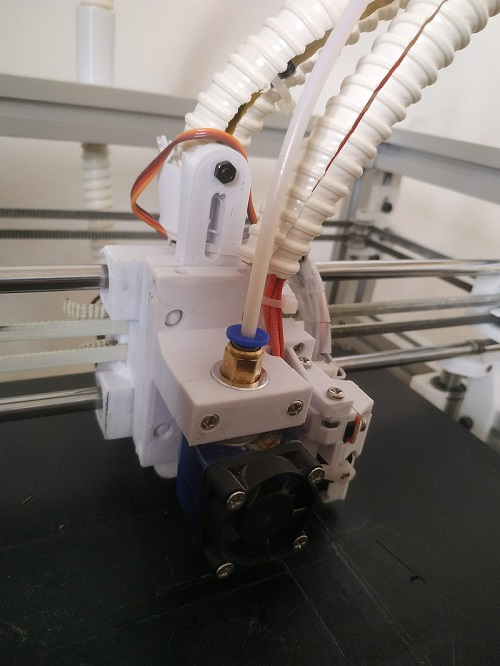
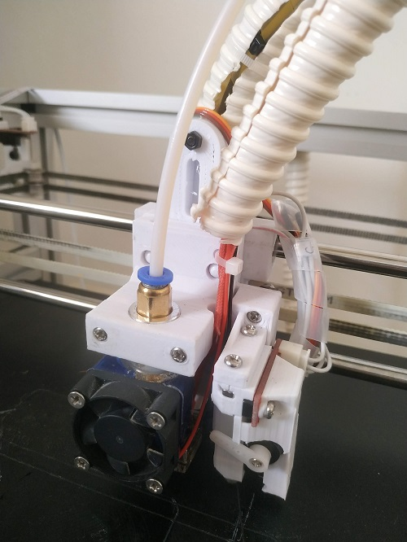
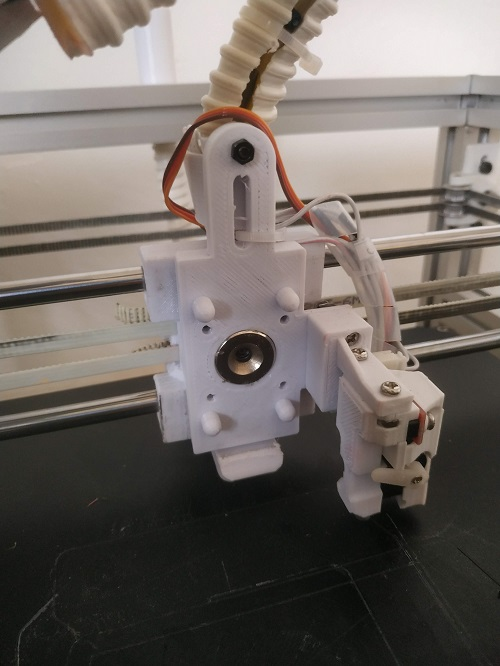
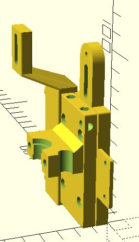
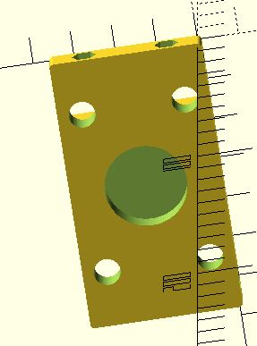
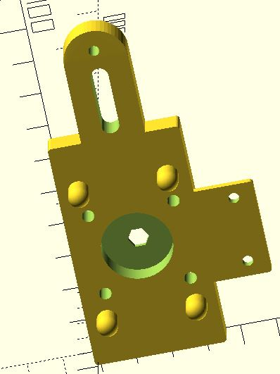
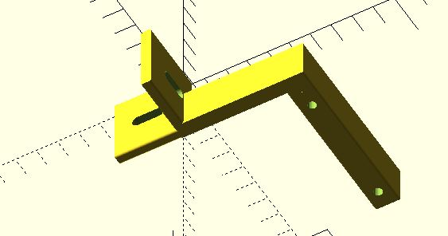
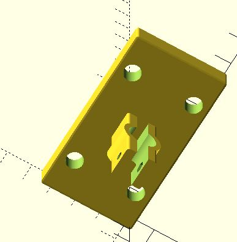
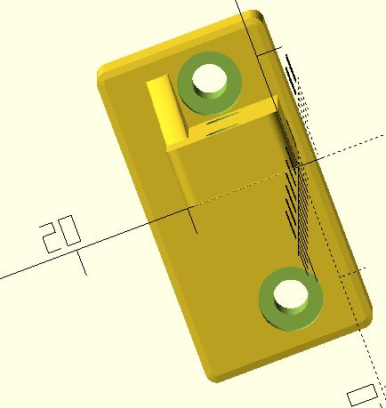
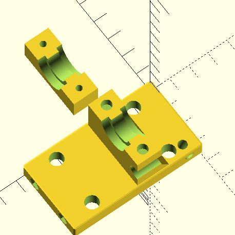

##### Magnetic Tool Changing
---
It's not finish but should work.

For me the issue is that the magnets are too srong and when the tool go off the x carrage adapter to the catcher it cause for miss steps 

##### What you will need 
---
20mm round magnets depth 5mm 

3mm screws, 3mm nuts and 3mm knurl nuts for the v6hotend holder

4mm screws for the tool catcher

##### Files Details
---
`startup.scad`: contains main things that shared cross files like magnet size, carriage size ...

`utils.scad`: contains utilities functions

`carrage_mount`: adapter between hypercube evolution x carriage and tool like v6 head, pen holder, laser

`v6hotend.scad`: v6 type hotend holder

`tool_catcherX`: This part should catch head (v6hotend, laser, penHolder)

`touch_mount-side`: adapter for touch sensor

`setTool.gcode`: example how to set the tool on the catcher and get it. 

when using duetwifi this should be in tfreeX.g and tpostX.g

##### images
---

